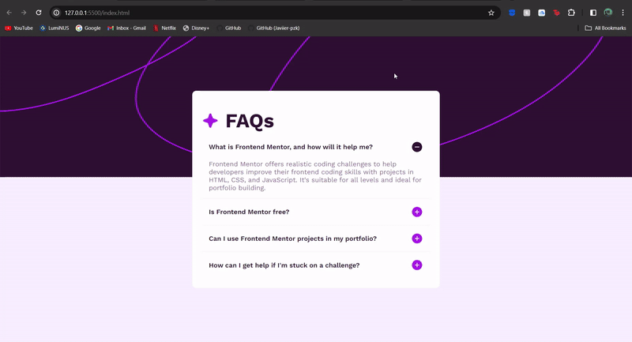

# Frontend Mentor - FAQ accordion solution

This is a solution to the [FAQ accordion challenge on Frontend Mentor](https://www.frontendmentor.io/challenges/faq-accordion-wyfFdeBwBz). 

## Table of contents

- [Overview](#overview)
  - [The challenge](#the-challenge)
  - [Screenshot](#screenshot)
  - [Links](#links)
- [My process](#my-process)
  - [Built with](#built-with)
  - [What I learned](#what-i-learned)
  - [Useful resources](#useful-resources)
- [Author](#author)

**Note: Delete this note and update the table of contents based on what sections you keep.**

## Overview

### The challenge

Users should be able to:

- Hide/Show the answer to a question when the question is clicked
- Navigate the questions and hide/show answers using keyboard navigation alone
- View the optimal layout for the interface depending on their device's screen size
- See hover and focus states for all interactive elements on the page

### Screenshot

### Links

- Live Site URL: [Add live site URL here](https://your-live-site-url.com)

## My process

### Built with

- Semantic HTML5 markup
- CSS
- Javascript

### What I learned

This project provided hands-on experience in DOM manipulation, event handling, and CSS styling for a polished user interface. Additionally, it enhanced my understanding of responsive design principles, ensuring the functionality works seamlessly across different devices and screen sizes. 

### Useful resources

- [w3schools](https://www.w3schools.com/) - W3Schools provides clear explanations, interactive examples, and comprehensive documentation that have helped me grasp fundamental concepts in HTML, CSS, and JavaScript. 

## Author
- Frontend Mentor - [@jarretphon](https://www.frontendmentor.io/profile/jarretphon)

